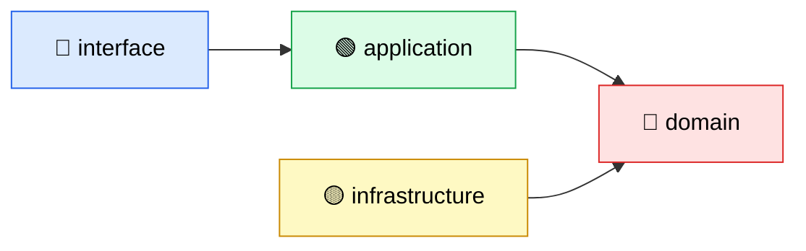
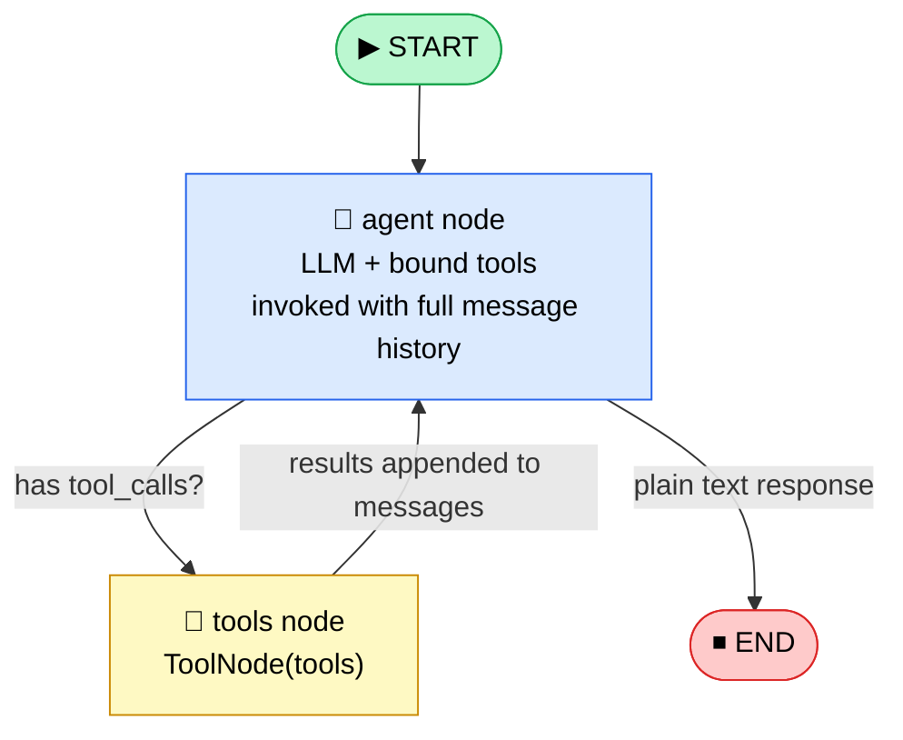
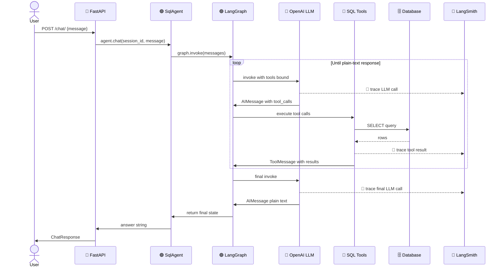
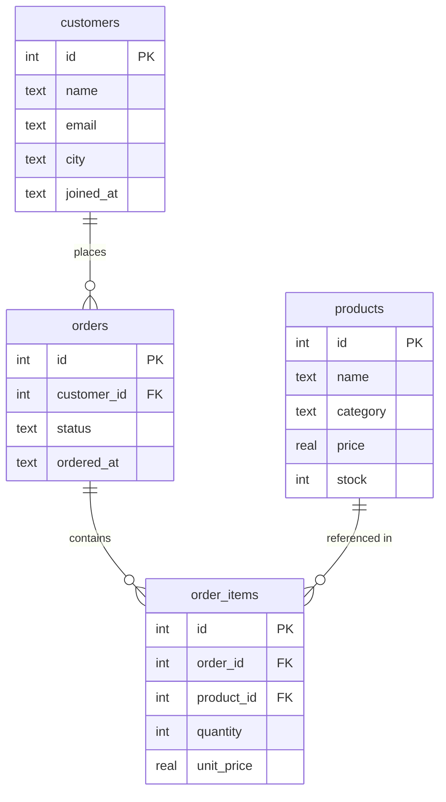
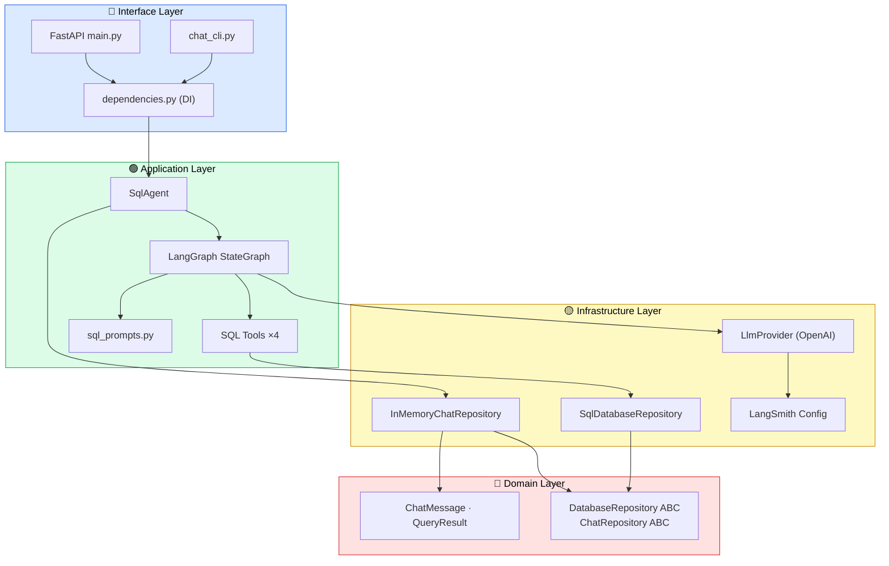

# 🤖 Implementation Prompt — NL→SQL Chatbot (LangChain + LangGraph + LangSmith)

## Your Task
Implement a production-grade **Natural Language to SQL chatbot** from scratch.
The user types questions in plain English; the agent inspects the database schema,
generates and executes SQL, and returns a human-readable answer.

Follow **Clean Architecture** strictly throughout. Every decision below is intentional
— do not deviate from the layer boundaries, naming conventions, or file structure.

---

## Tech Stack

| Concern | Library |
|---|---|
| LLM | `langchain-openai` (ChatOpenAI, gpt-4o-mini by default) |
| Agent orchestration | `langgraph` — `StateGraph` with `ToolNode` |
| Observability | `langsmith` — automatic tracing via env vars |
| SQL tools | `langchain-community` — `ListSQLDatabaseTool`, `InfoSQLDatabaseTool`, `QuerySQLDataBaseTool`, `QuerySQLCheckerTool` |
| DB abstraction | `langchain-community` `SQLDatabase` + raw `sqlalchemy` |
| API | `fastapi` + `uvicorn` |
| Config | `pydantic-settings` |
| Testing | `pytest` |

---

## Clean Architecture Layers



**Dependency Rule:** outer layers import inner layers. Inner layers NEVER import outer.
The domain layer has ZERO external library imports.

---

## Directory Structure (create every file listed)

```
# Repository root (workspace)
├── pyproject.toml                           # pytest pythonpath → nl_sql_chatbot/
├── tests/
│   └── test_domain.py                       # Unit tests: domain + InMemoryChatRepository
│
nl_sql_chatbot/                              # Python package root (run API/CLI/seed from here)
├── domain/                                  # 🔴 Pure Python — no frameworks
│   ├── __init__.py
│   ├── entities/
│   │   ├── __init__.py                      # exports ChatMessage, MessageRole, QueryResult
│   │   ├── chat_message.py                  # @dataclass ChatMessage + MessageRole enum
│   │   └── query_result.py                  # @dataclass QueryResult
│   ├── repositories/
│   │   ├── __init__.py
│   │   ├── database_repository.py           # ABC DatabaseRepository
│   │   └── chat_repository.py               # ABC ChatRepository
│   └── use_cases/
│       └── __init__.py
│
├── infrastructure/                          # 🟡 Implements domain ABCs + settings
│   ├── __init__.py
│   ├── settings.py                          # pydantic-settings BaseSettings, get_settings()
│   ├── ai/
│   │   ├── __init__.py
│   │   ├── llm_provider.py                  # create_llm() factory
│   │   └── langsmith_config.py              # configure_langsmith()
│   ├── database/
│   │   ├── __init__.py
│   │   ├── sql_database_repository.py       # SqlDatabaseRepository(DatabaseRepository)
│   │   └── seed.py                          # SQLite seeder for dev
│   └── memory/
│       ├── __init__.py
│       └── chat_memory_repository.py        # InMemoryChatRepository(ChatRepository)
│
├── application/                             # 🟢 LangGraph orchestration
│   ├── __init__.py
│   ├── agents/
│   │   ├── __init__.py
│   │   ├── state.py                         # AgentState TypedDict
│   │   ├── graph_builder.py                 # build_graph() → compiled StateGraph
│   │   └── sql_agent.py                     # SqlAgent facade (.chat() / .stream_chat())
│   ├── tools/
│   │   ├── __init__.py
│   │   └── sql_tools.py                     # build_sql_tools() → list[BaseTool]
│   └── prompts/
│       ├── __init__.py
│       └── sql_prompts.py                   # SYSTEM_PROMPT_TEMPLATE, ERROR_CORRECTION_PROMPT
│
├── interface/                               # 🔵 Delivery mechanisms
│   ├── __init__.py
│   ├── api/
│   │   ├── __init__.py
│   │   ├── main.py                          # FastAPI app factory + lifespan
│   │   ├── dependencies.py                  # @lru_cache DI: get_db_repo, get_agent
│   │   ├── routes/
│   │   │   ├── __init__.py
│   │   │   └── chat.py                      # GET /chat/health, POST /chat/, POST /chat/stream, DELETE /chat/session
│   │   └── schemas/
│   │       ├── __init__.py
│   │       └── chat_schema.py               # ChatRequest, ChatResponse, HealthResponse, ClearSessionRequest
│   └── cli/
│       ├── __init__.py
│       └── chat_cli.py                      # Interactive REPL with streaming output
│
├── data/                                    # Auto-created by seed.py
├── .env.example
└── requirements.txt
```

---

## File-by-File Specifications

### `requirements.txt`
```
langchain>=0.3.0
langchain-core>=0.3.0
langchain-community>=0.3.0
langchain-openai>=0.2.0
langgraph>=0.2.0
langsmith>=0.1.0
sqlalchemy>=2.0.0
fastapi>=0.115.0
uvicorn[standard]>=0.30.0
pydantic>=2.0.0
pydantic-settings>=2.0.0
python-dotenv>=1.0.0
httpx>=0.27.0
```

### `.env.example`
```env
OPENAI_API_KEY=sk-...
OPENAI_MODEL=gpt-4o-mini

LANGCHAIN_TRACING_V2=true
LANGCHAIN_API_KEY=ls__...
LANGCHAIN_PROJECT=nl-sql-chatbot
LANGCHAIN_ENDPOINT=https://api.smith.langchain.com

DATABASE_URL=sqlite:///./data/sample.db

APP_ENV=development
APP_DEBUG=true
MAX_QUERY_RESULTS=100
AGENT_MAX_ITERATIONS=10
```

---

### `infrastructure/settings.py`
Use `pydantic_settings.BaseSettings` with `SettingsConfigDict(env_file=".env", case_sensitive=False, extra="ignore")`.

Fields:
- `openai_api_key: str = ""`
- `openai_model: str = "gpt-4o-mini"`
- `langchain_tracing_v2: str = "false"`
- `langchain_api_key: str = ""`
- `langchain_project: str = "nl-sql-chatbot"`
- `langchain_endpoint: str = "https://api.smith.langchain.com"`
- `database_url: str = "sqlite:///./data/sample.db"`
- `app_env: str = "development"`
- `app_debug: bool = True`
- `max_query_results: int = 100`
- `agent_max_iterations: int = 10`

Expose a `@lru_cache` function `get_settings() -> Settings`.

---

### `domain/entities/chat_message.py`
Pure Python `@dataclass`. No imports outside stdlib.

```python
class MessageRole(str, Enum):
    USER = "user"
    ASSISTANT = "assistant"
    SYSTEM = "system"
    TOOL = "tool"

@dataclass
class ChatMessage:
    content: str
    role: MessageRole
    id: UUID = field(default_factory=uuid4)
    created_at: datetime = field(default_factory=datetime.utcnow)
    metadata: dict = field(default_factory=dict)

    def to_dict(self) -> dict: ...
    @classmethod def user(cls, content, **metadata) -> ChatMessage: ...
    @classmethod def assistant(cls, content, **metadata) -> ChatMessage: ...
```

### `domain/entities/query_result.py`
Pure Python `@dataclass`.

```python
@dataclass
class QueryResult:
    sql: str
    data: list[dict[str, Any]]
    natural_answer: str
    row_count: int = 0
    execution_time_ms: float = 0.0
    error: str | None = None
    executed_at: datetime = field(default_factory=datetime.utcnow)

    @property
    def success(self) -> bool: return self.error is None
    def to_dict(self) -> dict: ...
```

### `domain/repositories/database_repository.py`
```python
class DatabaseRepository(ABC):
    @abstractmethod def get_table_names(self) -> list[str]: ...
    @abstractmethod def get_table_schema(self, table_name: str) -> str: ...
    @abstractmethod def get_all_schemas(self) -> str: ...
    @abstractmethod def execute_query(self, sql: str) -> list[dict[str, Any]]: ...
    @abstractmethod def get_sample_rows(self, table_name: str, n: int = 3) -> list[dict]: ...
```

### `domain/repositories/chat_repository.py`
```python
class ChatRepository(ABC):
    @abstractmethod def save_message(self, session_id: str, message: ChatMessage) -> None: ...
    @abstractmethod def get_history(self, session_id: str) -> list[ChatMessage]: ...
    @abstractmethod def clear_session(self, session_id: str) -> None: ...
```

---

### `infrastructure/ai/llm_provider.py`
Factory function, not a class.

```python
def create_llm(*, model=None, temperature=0.0, streaming=False) -> BaseChatModel:
    # Returns ChatOpenAI using settings.openai_model and settings.openai_api_key
```

### `infrastructure/ai/langsmith_config.py`
```python
def configure_langsmith() -> None:
    # Sets os.environ for LANGCHAIN_TRACING_V2, LANGCHAIN_API_KEY,
    # LANGCHAIN_PROJECT, LANGCHAIN_ENDPOINT from settings.
    # Prints status message.
```

### `infrastructure/database/sql_database_repository.py`
Concrete implementation of `DatabaseRepository`. Key details:
- Constructor: `__init__(self, database_url: str, max_rows: int = 100)`
- Use `SQLDatabase.from_uri(database_url, sample_rows_in_table_info=3)` for schema introspection
- Reuse `self._db._engine` for raw SQLAlchemy query execution
- `execute_query` uses `sqlalchemy.text`, fetches with `fetchmany(self._max_rows)`, times with `perf_counter`, returns `(rows, elapsed_ms)` tuple
- `get_langchain_db(self) -> SQLDatabase` — exposes the LangChain wrapper for use in tools

### `infrastructure/database/seed.py`
Creates `data/sample.db` with this schema and seed data:

```sql
CREATE TABLE customers (id INTEGER PK, name TEXT, email TEXT UNIQUE, city TEXT, joined_at TEXT);
CREATE TABLE products  (id INTEGER PK, name TEXT, category TEXT, price REAL, stock INTEGER);
CREATE TABLE orders    (id INTEGER PK, customer_id FK, status TEXT, ordered_at TEXT);
CREATE TABLE order_items (id INTEGER PK, order_id FK, product_id FK, quantity INTEGER, unit_price REAL);
```

Seed 5 customers, 6 products, 7 orders, 10 order_items.
Expose a `seed()` function and `if __name__ == "__main__": seed()`.

### `infrastructure/memory/chat_memory_repository.py`
```python
class InMemoryChatRepository(ChatRepository):
    # Uses defaultdict(list) keyed by session_id
    # Also implement list_sessions(self) -> list[str]
```

---

### `application/agents/state.py`
```python
class AgentState(TypedDict):
    messages: Annotated[list[BaseMessage], add_messages]  # add_messages reducer
    session_id: str
```

### `application/prompts/sql_prompts.py`
Two string constants:

**`SYSTEM_PROMPT_TEMPLATE`** — format vars: `{table_info}`, `{max_rows}`
Content must include:
1. Role declaration as "expert data analyst assistant"
2. Available Tables section with `{table_info}`
3. Rules: always call list_tables first, get schema before writing SQL, SELECT only, limit rows, retry on error (max 2), explain results in plain English, say so if unanswerable
4. Response format: state intent → SQL code block → plain-English summary

**`ERROR_CORRECTION_PROMPT`** — format vars: `{error}`, `{sql}`

### `application/tools/sql_tools.py`
```python
def build_sql_tools(db_repo: SqlDatabaseRepository) -> list[BaseTool]:
    # Returns [ListSQLDatabaseTool, InfoSQLDatabaseTool,
    #          QuerySQLDataBaseTool, QuerySQLCheckerTool]
    # All initialized with db_repo.get_langchain_db()
    # QuerySQLCheckerTool also needs llm=create_llm()
```

### `application/agents/graph_builder.py`
LangGraph `StateGraph` with exactly two nodes:



Implementation details:
- `build_graph(llm, tools, table_info) -> CompiledStateGraph`
- Prepend `SystemMessage` (from `SYSTEM_PROMPT_TEMPLATE`) to messages inside `agent_node`
- Bind tools to LLM with `llm.bind_tools(tools)`
- Use `langgraph.prebuilt.ToolNode` for the tools node
- Use `langgraph.prebuilt.tools_condition` for the conditional edge
- Return `graph.compile()`

### `application/agents/sql_agent.py`
High-level facade. Constructor wires everything:

```python
class SqlAgent:
    def __init__(self, db_repo: SqlDatabaseRepository, chat_repo: ChatRepository):
        # create_llm() → build_sql_tools(db_repo) → db_repo.get_all_schemas()
        # → build_graph(llm, tools, schema) → self._graph

    def chat(self, session_id: str, user_input: str) -> str:
        # 1. Save user ChatMessage to chat_repo
        # 2. Load history, convert to [HumanMessage|AIMessage]
        # 3. graph.invoke({"messages": lc_messages, "session_id": session_id})
        # 4. Extract last message content
        # 5. Save assistant ChatMessage to chat_repo
        # 6. Return answer string

    def stream_chat(self, session_id: str, user_input: str) -> Generator[str, None, None]:
        # Same as chat() but uses graph.stream(..., stream_mode="values")
        # Yield incremental text deltas
        # Save full answer to chat_repo after streaming completes

    def clear_session(self, session_id: str) -> None: ...
```

---

### `interface/api/schemas/chat_schema.py`
```python
class ChatRequest(BaseModel):
    session_id: str
    message: str

class ChatResponse(BaseModel):
    session_id: str
    answer: str
    message_count: int | None = None

class ClearSessionRequest(BaseModel):
    session_id: str

class HealthResponse(BaseModel):
    status: str = "ok"
    tables: list[str] = []
```

### `interface/api/dependencies.py`
Three `@lru_cache` singleton factories:
```python
def get_db_repo() -> SqlDatabaseRepository: ...
def get_chat_repo() -> InMemoryChatRepository: ...
def get_agent() -> SqlAgent: ...
```

### `interface/api/routes/chat.py`
```
GET    /chat/health   → HealthResponse (db_repo.get_table_names())
POST   /chat/         → ChatResponse   (agent.chat(...))
POST   /chat/stream   → StreamingResponse, media_type="text/event-stream"
                        yields: "data: {chunk}\n\n" ... "data: [DONE]\n\n"
DELETE /chat/session  → {"message": "Session '...' cleared."}
```

All routes use `Depends(get_agent)` or `Depends(get_db_repo)`.
Wrap logic in try/except and raise `HTTPException(status_code=500)` on error.

### `interface/api/main.py`
```python
def create_app() -> FastAPI:
    # FastAPI with lifespan context manager
    # lifespan startup: configure_langsmith(), print ready message
    # Add CORSMiddleware(allow_origins=["*"], ...)
    # Include chat_router

app = create_app()
# if __name__ == "__main__": uvicorn.run(... port=8000, reload=True)
```

### `interface/cli/chat_cli.py`
Interactive REPL:
- Print a banner with project name on start
- Show connected database URL and available tables
- Show session ID
- Commands: `quit`/`exit`/`q` → exit, `clear` → new session_id + clear history
- Use `agent.stream_chat()` and print chunks with `flush=True`
- Handle `KeyboardInterrupt` / `EOFError` gracefully

---

### `tests/test_domain.py`
Write pytest test classes (no mocks, no LLM calls, no I/O):

**`TestChatMessage`**
- `test_user_factory` — role==USER, content correct, id is UUID, created_at is datetime
- `test_assistant_factory` — role==ASSISTANT
- `test_to_dict` — keys: role, content, id, created_at present

**`TestQueryResult`**
- `test_success_property` — error=None → success=True
- `test_failure_property` — error set → success=False
- `test_to_dict` — keys: sql, success present

**`TestInMemoryChatRepository`**
- `test_save_and_retrieve` — 2 messages saved, 2 returned in order
- `test_sessions_are_isolated` — session-A and session-B don't bleed
- `test_clear_session` — after clear, get_history returns []

---

## LangSmith Integration

LangSmith requires **zero code changes** to trace — it activates automatically when these env vars are set before the first LangChain call:
```
LANGCHAIN_TRACING_V2=true
LANGCHAIN_API_KEY=<your key>
LANGCHAIN_PROJECT=nl-sql-chatbot
```

`configure_langsmith()` must be called at application startup (in FastAPI lifespan and in CLI `run()`). It sets the env vars from `Settings` and prints confirmation.

What gets traced automatically per request:
- Every `agent_node` LLM invocation (prompt, response, tokens, latency)
- Every tool call (name, inputs, outputs)
- The full graph execution timeline
- Multi-turn conversation history



---

## Sample Database Schema



---

## Component Wiring Diagram



---

## Execution Order After Implementation

```bash
# 1. Install
pip install -r requirements.txt

# 2. Configure
cp .env.example .env
# Fill in OPENAI_API_KEY and LANGCHAIN_API_KEY

# 3. Seed sample database
python -m infrastructure.database.seed

# 4a. Start API
uvicorn interface.api.main:app --reload
# → http://localhost:8000/docs

# 4b. OR start CLI
python -m interface.cli.chat_cli

# 5. Run tests
pytest tests/ -v
```

---

## Strict Rules to Follow

1. **Domain has zero external imports** — only Python stdlib (`abc`, `dataclasses`, `datetime`, `enum`, `uuid`, `typing`)
2. **Infrastructure implements domain ABCs** — `SqlDatabaseRepository(DatabaseRepository)`, `InMemoryChatRepository(ChatRepository)`
3. **Application layer only imports from** `domain/`, `infrastructure/` (for concrete types needed at wiring), and LangChain/LangGraph
4. **Interface layer only imports from** `application/`, `infrastructure/` (via DI), and FastAPI/Pydantic
5. **No circular imports** — enforce with the dependency rule diagram above
6. **All settings via `get_settings()`** — never hardcode API keys, URLs, or model names
7. **LangSmith is always configured at startup** before any LangChain call
8. **SQL execution is always read-only** — agent system prompt forbids non-SELECT; tools do not expose write operations
9. **`@lru_cache` on all DI factories** — `get_db_repo`, `get_chat_repo`, `get_agent`, `get_settings` are all singletons
10. **Every `__init__.py`** in each package must exist (even if empty)
