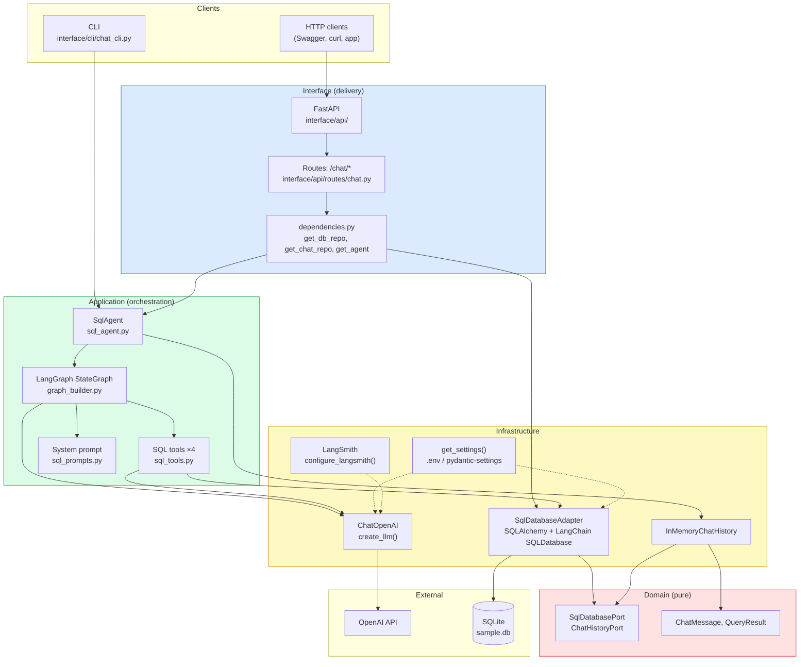
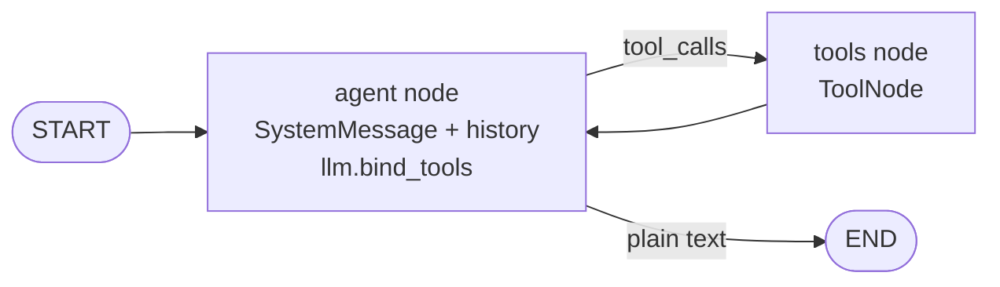
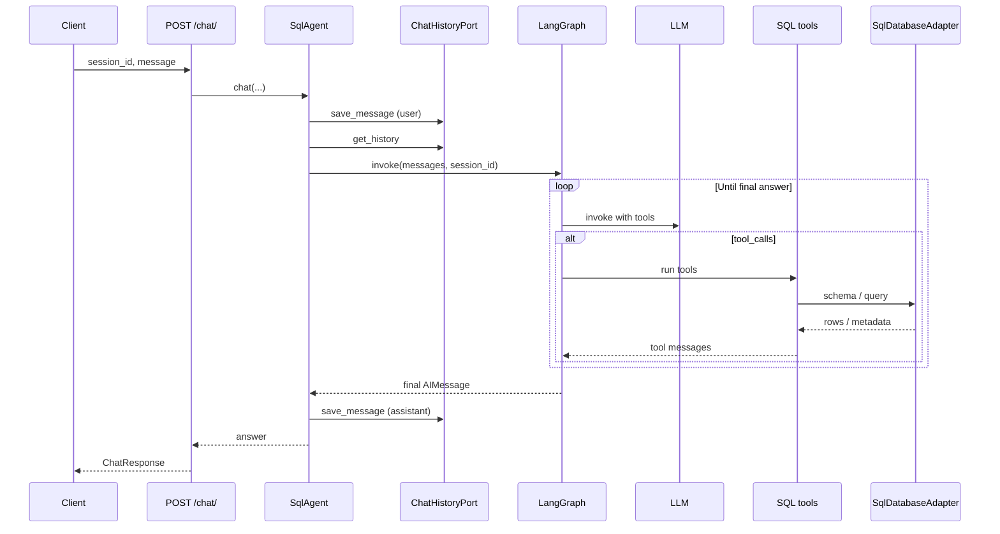

# Kiến trúc hệ thống NL→SQL Chatbot

Tài liệu này mô tả kiến trúc ứng dụng **FastAPI + LangGraph** trong thư mục `nl_sql_chatbot/`, theo hướng **Clean Architecture** (interface → application → domain; infrastructure triển khai các port của domain).

---

## Tổng quan các thành phần

---

## Luồng LangGraph (agent ↔ tools)

`build_graph()` tạo đồ thị hai nút: LLM có tool gắn kèm và `ToolNode` thực thi các lệnh gọi công cụ. Vòng lặp kết thúc khi model trả lời dạng văn bản (không còn `tool_calls`).

---

## Luồng xử lý một yêu cầu chat (API)

---

## Quy tắc phụ thuộc (Clean Architecture)

- **Domain**: không phụ thuộc framework; chỉ định **entities** và **ports** (interface ABC).
- **Application**: điều phối LangGraph và tools; dùng port để nói chuyện với DB và lịch sử chat.
- **Infrastructure**: triển khai port (`SqlDatabaseAdapter`, `InMemoryChatHistory`), cấu hình LLM, settings.
- **Interface**: HTTP (FastAPI) hoặc CLI; chỉ **wire** qua dependency injection tới `SqlAgent` và adapter.

Chi tiết triển khai file theo từng lớp xem `README.md` (mục directory structure) và mã nguồn trong `nl_sql_chatbot/`.
